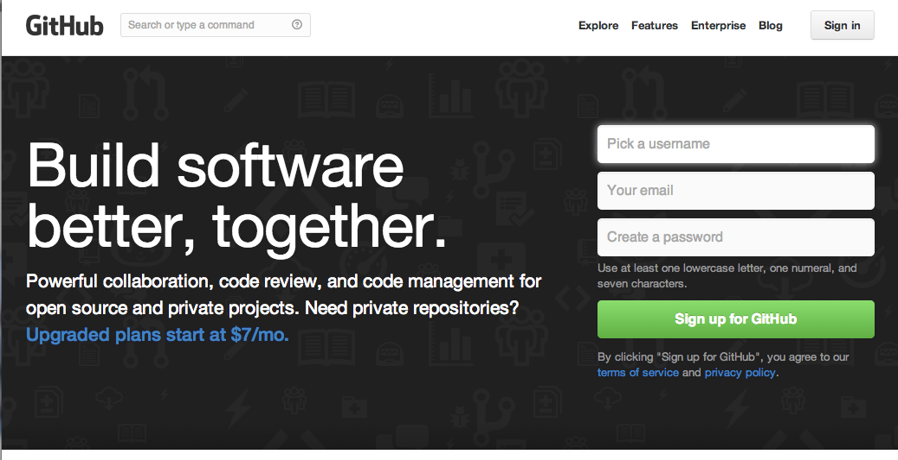

lecture2
========

Git を学びます

ポイント
-------------
- Git とは
- GitHub を使って Git を体験する

1. Git とは
-----------

[サルでもわかるGit入門](http://www.backlog.jp/git-guide/) を使って Git の説明をします。

2. GitHub を使って Git を体験する
--------------------------------

[GitHub](https://github.com/) というサービスを使って Git を体験してます。Window を利用している人は、[GitHub for Windows](http://windows.github.com/) というツールを使うと便利です。Mac を利用している人は、[GitHub for Mac](http://mac.github.com/) というツールがあります。

それぞれインストールして使ってみましょう。最初に GitHub にアカウントを作る必要がありますので [GitHub](https://github.com) にアクセスして「Sign up for GitHub」からアカウントを作成します。

GitHub for Windows （or Mac）の使い方のチュートリアルは [Git Tutorial For Designers](http://chocolatina.github.io/github-for-windows-tutorial/) が参考になります。

ひとりでの演習
--------------

* リポジトリの説明
* ワークツリー、インデックス、リポジトリの違いの説明
* ローカルリポジトリとリモートリポジトリの違いの説明
* インデックスへの追加とリポジトリへのコミットの説明
* リモートリポジトリへのプッシュの説明

グループでの演習
----------------

* ブランチの作成
* リモートリポジトリからのプルの説明（fetch と merge）
* マージの説明
